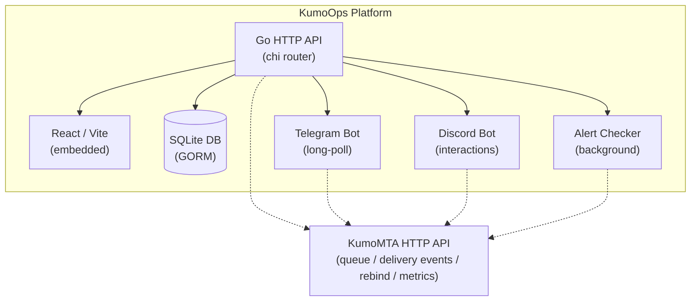

# KumoOps


**KumoOps** is a full-featured operations platform for [KumoMTA](https://kumomta.com). It combines a polished web dashboard, an AI-powered log analyser, and full two-way bots for **Telegram** and **Discord** into a single self-hosted binary — no cloud dependency, runs entirely on your VPS.

> Formerly "KumoMTA UI" — grown from a simple control panel into a complete MTA operations suite.

---

## What's Inside

| Layer | Stack |
|---|---|
| Backend | Go 1.22+, chi router, GORM, SQLite |
| Frontend | React 18, Vite, Tailwind CSS |
| Bots | Telegram (long-poll) + Discord (interactions endpoint) |
| AI | Claude API — log analysis and operational insights |

---

## Features

### Dashboard & Monitoring
- **Dashboard** — live CPU, RAM, domain/sender count, service health (KumoMTA / Dovecot / Fail2Ban), open ports
- **Statistics** — per-domain and per-sender delivery charts (sent, delivered, bounced, deferred, rate) with time-range selector
- **Delivery Log** — full event log with domain/type/date filters and CSV export
- **Bounce Analytics** — breakdown by ISP, bounce category, and trend over time
- **AI Log Analysis** — Claude-powered analyser: spots errors, explains log entries, suggests fixes in plain English

### Email Infrastructure Management
- **Domains** — add sending domains, verify SPF / DKIM / DMARC DNS records
- **DKIM** — generate, rotate, and publish DKIM keys per selector
- **DMARC** — policy builder and aggregate report viewer
- **Auth Tools** — end-to-end email authentication tester
- **IP Inventory** — manage dedicated IPs with pool assignment
- **IP Pools** — group IPs by purpose (transactional, bulk, warmup)
- **IP Warmup** — automated warmup schedules with daily volume ramps and progress tracking
- **Traffic Shaping** — per-domain/per-IP throttling, connection limits, retry policies
- **Reputation** — DNSBL blacklist checks (Spamhaus, SORBS, Barracuda, etc.) with alerting on new listings
- **Config Generator** — GUI-based KumoMTA `.lua` config builder

### Campaigns
- Create campaigns and send to contact lists
- Real-time send progress, pause / resume mid-flight
- Per-campaign delivery stats
- Contact list import (CSV / JSON)

### Alerting & Notifications
- Configurable triggers: bounce-rate spike, blacklist hit, queue depth, service down
- Delivery channels: Telegram, Discord webhook, email
- Per-domain alert thresholds

### Queue Management
- Browse queued messages with search and domain filter
- Retry individual messages or flush all deferred at once
- Drop bounced / failed messages in bulk

### System
- **System Tools** — start / stop / restart / reload KumoMTA, view systemd journal
- **Live Logs** — real-time log stream in the browser (WebSocket)
- **Security** — Fail2Ban integration, login audit log, IP block/allow list
- **API Keys** — generate tokens for external API access
- **Webhooks** — outgoing webhooks for delivery events
- **Remote Servers** — manage multiple KumoMTA instances from one panel
- **2FA** — TOTP two-factor authentication (Google Authenticator, Authy, etc.)

---

## Bot Commands

Both Telegram and Discord support the full command set.

- **Discord** uses native slash commands with autocomplete. Destructive commands show **Confirm ✅ / Cancel ❌ buttons**.
- **Telegram** uses `/command` text messages. Destructive commands ask you to type `/confirm` or `/cancel`.

| Command | Description |
|---|---|
| `/help` | List all available commands |
| `/stats` | Today's delivery stats — sent, delivered, bounced, deferred, rate |
| `/queue` | Queue depth broken down by destination domain |
| `/bounces` | Bounce summary for the last 24 hours |
| `/tail [n]` | Last N KumoMTA log lines (default 20, max 50) |
| `/reputation` | Latest DNSBL blacklist check results |
| `/check` | Run a fresh DNSBL scan across all IPs and domains |
| `/campaigns` | List the last 10 campaigns with status |
| `/pause-campaign <id>` | Pause a running campaign |
| `/resume-campaign <id>` | Resume a paused campaign |
| `/warmup` | Warmup status per sender (plan, current day, daily volume) |
| `/disk` | Disk usage |
| `/mem` | Memory and CPU overview |
| `/flush` | ⚠️ Flush all deferred messages |
| `/retry-all` | ⚠️ Force retry all deferred messages |
| `/drop-bounced` | ⚠️ Drop all bounced/failed messages from the queue |
| `/reload` | ⚠️ Reload KumoMTA config without downtime |
| `/restart` | ⚠️ Restart the KumoMTA service |

> ⚠️ Destructive commands require confirmation before executing.

---

## Setup

### Requirements

- Linux VPS (Rocky Linux 9 recommended)
- [KumoMTA](https://docs.kumomta.com) installed and running
- Go 1.22+ *(build only)*
- Node.js 20+ *(build only)*

### Quick Install (Rocky Linux 9)

```bash
# 1. Update your system
sudo dnf update -y

# 2. Install Git
sudo dnf install -y git

# 3. Clone the repository
sudo mkdir -p /opt/kumoops
sudo git clone https://github.com/pulak-ranjan/kumoops.git /opt/kumoops
cd /opt/kumoops

# 4. Run the installer
sudo bash scripts/install-kumoops-rocky9.sh
```

> The installer sets up KumoMTA, builds the backend and frontend, configures systemd, firewall, Nginx, and optionally provisions a Let's Encrypt SSL certificate.

### Build from source

```bash
git clone https://github.com/pulak-ranjan/kumoops
cd kumoops

# 1 — Build frontend (output lands in web/dist, embedded into the binary)
cd web && npm install && npm run build && cd ..

# 2 — Build the binary
go build -o kumoops ./cmd/server/main.go

# 3 — Run database migrations (creates kumoops.db on first run)
./kumoops migrate
```

### Run

```bash
./kumoops
# → listening on :8080
```

**Environment variables:**

| Variable | Default | Description |
|---|---|---|
| `PORT` | `8080` | HTTP listen port |
| `DB_PATH` | `./kumoops.db` | SQLite database path |
| `JWT_SECRET` | auto-generated | Override JWT signing secret |
| `KUMOMTA_API` | `http://127.0.0.1:8000` | KumoMTA HTTP API base URL |

### systemd service

```ini
# /etc/systemd/system/kumoops.service
[Unit]
Description=KumoOps
After=network.target kumomta.service

[Service]
ExecStart=/opt/kumoops/kumoops
WorkingDirectory=/opt/kumoops
Restart=always
RestartSec=5
Environment=PORT=8080

[Install]
WantedBy=multi-user.target
```

```bash
sudo systemctl daemon-reload
sudo systemctl enable --now kumoops
```

### First login

Open `http://your-server:8080` — you will be prompted to create the admin account on first visit. Enable 2FA from the Settings page afterwards.

---

## Bot Configuration

### Telegram

1. Message [@BotFather](https://t.me/BotFather) → `/newbot` → copy the **Bot Token**
2. Get your **Chat ID**: send any message to your bot, then visit `https://api.telegram.org/bot<TOKEN>/getUpdates` and note the `chat.id`
3. Open **Settings → Telegram Bot**, enter the token and chat ID, enable
4. The bot starts polling immediately — no public URL needed

### Discord

Discord requires a public HTTPS endpoint for interactions:

1. Go to [discord.com/developers/applications](https://discord.com/developers/applications) → **New Application**
2. **Bot** tab → **Reset Token** → copy the **Bot Token**
3. **General Information** tab → copy the **Application ID** and **Public Key**
4. In **Settings → Discord Bot**, fill in all three fields and toggle **Enable Discord Bot**
5. **Save Settings**, then set the **Interactions Endpoint URL** in the Discord portal:
   ```
   https://your-domain/api/discord/interactions
   ```
   *(Discord will verify the endpoint on save — the server must be publicly reachable over HTTPS)*
6. Click **Register Slash Commands** in Settings once — all commands appear in Discord immediately

---

## Architecture



**Key packages:**

| Path | Purpose |
|---|---|
| `cmd/server` | Entry point — starts HTTP server + Telegram bot goroutine |
| `internal/api/` | HTTP handlers — one file per domain (38 files) |
| `internal/core/` | Business logic — stats, queue, bots, alerting, DKIM, DMARC, reputation, config gen, campaigns |
| `internal/models/` | GORM model definitions |
| `internal/store/` | Database layer — queries and CRUD |
| `web/src/` | React frontend (Vite, Tailwind CSS) |

---

## REST API

All endpoints require `Authorization: Bearer <token>` (token returned at login), **except:**

| Endpoint | Auth |
|---|---|
| `POST /api/auth/register` | Public (first-run only) |
| `POST /api/auth/login` | Public |
| `POST /api/auth/verify-2fa` | Public |
| `POST /api/discord/interactions` | Ed25519 signature (Discord) |

All routes are registered in `internal/api/server.go`. A full OpenAPI spec is on the roadmap.

---

## Themes

Switch between **Light**, **System**, and **Dark** from the sidebar footer. The preference persists in `localStorage`.

---

## Development

```bash
# Backend with hot reload (requires github.com/air-verse/air)
air

# Frontend dev server with HMR (proxies /api/* to :8080)
cd web && npm run dev
```

---

## Roadmap

- [ ] OpenAPI / Swagger docs
- [ ] Multi-user roles (read-only, operator, admin)
- [ ] Per-domain delivery reports (PDF export)
- [ ] Slack bot integration
- [ ] Docker / docker-compose setup
- [ ] Prometheus metrics endpoint

---

## License

MIT — see [LICENSE](LICENSE).

---

## Credits

Built on top of [KumoMTA](https://kumomta.com) — a next-generation MTA written in Rust with a Lua policy scripting layer, designed for high-volume, high-deliverability email sending.
