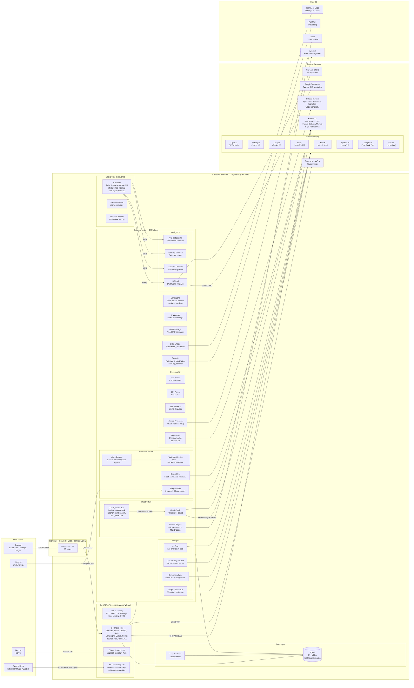

<p align="center">
  
  
  
  
  
  
  
</p>

<h1 align="center">KumoOps</h1>

<p align="center">
  <strong>The open-source operations platform for <a href="https://kumomta.com">KumoMTA</a></strong><br/>
  Dashboard, AI deliverability intelligence, Telegram & Discord bots, adaptive throttling, anomaly detection — all in a single self-hosted binary.
</p>

<p align="center">
  <a href="#quick-install">Install in 60 seconds</a> &bull;
  <a href="#features">Features</a> &bull;
  <a href="#use-cases">Use Cases</a> &bull;
  <a href="#ai-providers">AI Providers</a> &bull;
  <a href="docs/API.md">API Reference</a> &bull;
  <a href="#support--contact">Get Help</a>
</p>

---

## What is KumoOps?

**KumoOps** is a full-featured, self-hosted control panel and operations suite for [KumoMTA](https://kumomta.com) — the next-generation mail transfer agent written in Rust. It gives you everything you need to **monitor, manage, and optimize** high-volume email infrastructure from a single dashboard.

Think of it as **your mission control for email delivery** — combining real-time monitoring, AI-powered deliverability intelligence, automated reputation management, and remote bot operations into one platform.

> **No cloud dependency. No subscription. No data leaves your server.**
> Install it on your VPS, and you own everything.

### Why KumoOps?

| | **KumoOps** | GreenArrow | PowerMTA Console | Postal | Mautic |
|---|:---:|:---:|:---:|:---:|:---:|
| **Price** | Free & Open Source | $$$$ / month | $$$$ / license | Free | Free |
| **AI Deliverability Advisor** | 8 providers + local Ollama | No | No | No | No |
| **Adaptive Throttling** | Auto-adjusts per ISP | Manual only | Manual only | No | No |
| **Anomaly Detection** | Auto-heals + alerts | No | No | No | No |
| **Telegram / Discord Bot** | Full command set | No | No | No | No |
| **KumoMTA Native** | Built for it | No | No | No | No |
| **Single Binary** | Yes | No | No | No | No |
| **FBL + VERP + DSN** | Built-in parsers | Partial | Partial | No | No |
| **ISP Intelligence** | Google Postmaster + SNDS | No | No | No | No |
| **Multi-Node Cluster** | Yes | Enterprise only | No | No | No |

---

## Use Cases

### Email Service Providers (ESPs)
You run a sending platform for clients. KumoOps gives you per-domain reputation tracking, adaptive throttling that auto-adjusts when Gmail or Outlook starts deferring, AI-powered content analysis before sends, and instant Telegram/Discord alerts when something goes wrong. Manage everything from one panel instead of SSH-ing into servers.

### Marketing Teams & Agencies
You send high-volume campaigns and need to keep inbox placement high. KumoOps provides A/B testing with automatic winner selection, warmup automation for new IPs, bounce classification (hard/soft/spam), and a pre-send scoring system that catches deliverability issues before you hit send.

### SaaS & Transactional Email
Your application sends password resets, notifications, and invoices through KumoMTA. KumoOps monitors delivery rates in real-time, catches bounce spikes via anomaly detection, and auto-pauses campaigns if complaint rates exceed thresholds. The HTTP Sending API is Mailgun-compatible — swap your API URL and it works.

### DevOps & Infrastructure Teams
You manage multiple KumoMTA nodes across regions. KumoOps provides multi-node cluster management from a single dashboard, system health monitoring (CPU, RAM, disk, service status), queue management with retry/flush/drop controls, and a Fail2Ban integration for security.

### Independent Senders & Newsletter Operators
You run your own mail server to avoid platform lock-in and recurring costs. KumoOps makes self-hosted email manageable with DKIM/DMARC/SPF setup wizards, domain verification, blacklist monitoring with one-click delist links, and AI log analysis that explains errors in plain English.

---

## Features

### Dashboard & Monitoring
- **Real-time Dashboard** — live CPU, RAM, disk, domain/sender count, service health (KumoMTA, Dovecot, Fail2Ban), open ports
- **Statistics** — per-domain and per-sender delivery charts (sent, delivered, bounced, deferred, rate) with time-range selector
- **Delivery Log** — full event log with domain/type/date filters, CSV export, enriched with queue, egress pool, MX server, bounce classification
- **Bounce Analytics** — breakdown by ISP, bounce category (hard/soft/spam/transient), and trend over time
- **Live Logs** — real-time KumoMTA log stream in the browser via WebSocket
- **AI Log Analysis** — floating AI chat assistant that spots errors, explains log entries, and suggests fixes

### Email Infrastructure Management
- **Domains** — add sending domains, one-click SPF / DKIM / DMARC DNS verification
- **DKIM** — generate, rotate, and publish DKIM keys per selector with domain dropdown
- **DMARC** — policy builder and aggregate report viewer
- **Auth Tools** — end-to-end email authentication checker (BIMI, MTA-STS, SPF, DKIM, DMARC live lookup)
- **IP Pools** — group dedicated IPs by purpose (transactional, bulk, warmup)
- **IP Warmup** — automated warmup schedules with daily volume ramps and progress tracking
- **Traffic Shaping** — per-domain / per-IP throttling, connection limits, retry policies
- **Reputation Manager** — DNSBL blacklist checks (Spamhaus, Barracuda, SpamCop, UCEPROTECT, SURBL, etc.) with delist links and alerting on new listings
- **Config Generator** — GUI-based KumoMTA `.lua` config builder

### Deliverability Intelligence
- **FBL + Complaint Management** — RFC 5965 ARF/FBL parser; complaint stats by ISP; automatic suppression
- **DSN / Bounce Classification** — RFC 3464 DSN parser; automatic categorisation (hard / soft / spam / transient) with per-ISP analytics
- **VERP Engine** — HMAC-SHA256 variable envelope return paths for per-recipient bounce isolation
- **ISP Intelligence** — Google Postmaster Tools + Microsoft SNDS integration; domain reputation, IP reputation, spam rate, FBL rate; 7-day trend sparklines
- **Adaptive Throttling** — auto-tightens per-ISP sending rates when reputation drops; auto-relaxes when it recovers; 5-minute cycles with full audit log
- **Anomaly Detection & Self-Healing** — detects bounce spikes, complaint surges, queue buildup, delivery rate drops; applies auto-fixes (pause campaign, tighten throttle); fires alerts across all channels

### Campaigns & Sending
- **Campaign Management** — create, send, pause, resume campaigns with real-time progress
- **Contact Lists** — import via CSV / JSON
- **A/B Testing** — subject/body variants with split percentages; auto winner selection (by open or click rate) every 5 minutes
- **Send-Time Optimization** — 7x24 engagement heatmap from open/click data; top-5 optimal time-slot recommendations
- **Inbox Placement Testing** — manage seed mailboxes (IMAP); check inbox / spam / missing across providers
- **HTTP Sending API** — Mailgun-compatible `POST /api/v1/messages`; use any API key with `send` scope; works with MailWizz, Mautic, Python, PHP, anything
- **SMTP Relay Management** — configure as a relay hub; manage allowed IPs, connection limits, rate limits

### AI Intelligence Layer
- **Deliverability Advisor** — aggregates ISP reputation, anomalies, FBL complaints, bounces, and throttle data; sends to AI; returns a 0-100 score with ranked issues and actionable recommendations
- **Content Analyzer** — paste HTML + subject line; AI scores spam risk (0-10) and deliverability (0-100) with specific issues and suggestions
- **Subject Line Generator** — provide topic, audience, tone, goal; AI generates variants with style tags (curiosity, urgency, benefit, social-proof) and emoji versions
- **Pre-Send Score** — local computed check (no AI cost): validates subject length, body/HTML ratio, sender reputation, list quality, active anomalies, unsubscribe config; A-F grade with per-factor breakdown

### Bot Operations (Telegram & Discord)
Full command set for remote MTA management — no need to open the dashboard:

| Command | What it does |
|---|---|
| `/stats` | Today's delivery stats — sent, delivered, bounced, deferred, rate |
| `/queue` | Queue depth by destination domain |
| `/bounces` | Bounce summary for the last 24 hours |
| `/tail [n]` | Last N log lines (default 20, max 50) |
| `/reputation` | Latest DNSBL blacklist check results |
| `/check` | Run a fresh DNSBL scan across all IPs and domains |
| `/campaigns` | Last 10 campaigns with status |
| `/pause-campaign <id>` | Pause a running campaign |
| `/resume-campaign <id>` | Resume a paused campaign |
| `/warmup` | Warmup status per sender |
| `/disk` | Disk usage |
| `/mem` | Memory and CPU overview |
| `/flush` | Flush all deferred messages (requires confirmation) |
| `/retry-all` | Force retry all deferred messages (requires confirmation) |
| `/drop-bounced` | Drop all bounced/failed messages (requires confirmation) |
| `/reload` | Reload KumoMTA config without downtime (requires confirmation) |
| `/restart` | Restart KumoMTA service (requires confirmation) |

- **Discord** uses native slash commands with autocomplete. Destructive commands show Confirm / Cancel buttons.
- **Telegram** uses `/command` messages. Destructive commands ask you to type `/confirm` or `/cancel`.

### Security & Access Control
- **JWT Authentication** with TOTP two-factor (Google Authenticator, Authy)
- **Scoped API Keys** — `kumo_xxxxxx` format with granular scopes: `send`, `relay`, `verify`, `cluster`, `read`
- **Fail2Ban Integration** — IP block/allow lists, login audit log
- **Rate Limiting** — separate rate limiters for auth routes and general API
- **Encrypted Secrets** — AI keys, bot tokens, and SMTP passwords encrypted at rest with AES-256
- **HTTPS** — Nginx reverse proxy with Let's Encrypt auto-provisioning via installer

### Multi-Node Cluster
```
VPS-1 (Primary)          VPS-2 (Secondary)        VPS-3 (Secondary)
┌─────────────────┐      ┌──────────────────┐     ┌──────────────────┐
│   KumoOps UI    │ ──── │   KumoOps API    │ ──  │   KumoOps API    │
│   (dashboard)   │      │   (node agent)   │     │   (node agent)   │
│   :9000         │      │   :9000          │     │   :9000          │
└─────────────────┘      └──────────────────┘     └──────────────────┘
```
1. On secondary node → Settings → API Keys → Create Key with `cluster` scope
2. On primary node → Remote Servers → Add Server → paste URL + API key
3. Primary now shows health, metrics, and can push config to all nodes

---

## AI Providers

KumoOps supports **8 AI providers**. Set your preferred provider in Settings → AI Configuration.

| Provider | Model | Type | Notes |
|---|---|---|---|
| **OpenAI** | GPT-4o-mini | Cloud | Best general quality |
| **Anthropic** | Claude 3.5 Haiku | Cloud | Great at structured analysis |
| **Google Gemini** | Gemini 2.0 Flash | Cloud | Fast, generous free tier |
| **Groq** | Llama 3.3 70B | Cloud | Very fast inference, generous free tier |
| **Mistral** | Mistral Small | Cloud | European-hosted, privacy-friendly |
| **Together AI** | Llama 3.2 11B | Cloud | Open model, affordable |
| **DeepSeek** | DeepSeek Chat | Cloud | Excellent reasoning, very low cost |
| **Ollama** | Any local model | Local | **Completely free — runs on your VPS** |

### Ollama Setup (free, private, no API key needed)

```bash
curl -fsSL https://ollama.com/install.sh | sh
ollama pull llama3.2        # 2GB — fast
ollama pull mistral         # 4GB — better quality
# Set base URL to http://localhost:11434 in Settings
```

---

## Quick Install

### One-Command Install (Rocky Linux 9)

```bash
sudo bash <(curl -fsSL https://raw.githubusercontent.com/pulak-ranjan/kumoops/main/scripts/install-kumoops-rocky9.sh)
```

This installs KumoMTA + KumoOps, builds everything, configures systemd, Nginx, firewall, and optionally provisions Let's Encrypt SSL.

### Docker (for development / testing only)

> **Important:** In production, we recommend installing KumoOps directly on the same server as KumoMTA (using the one-command installer above). KumoMTA binds to host network interfaces and ports — running KumoOps inside Docker adds unnecessary network complexity, and features like system monitoring, log streaming, service control, and Fail2Ban integration require direct host access. Docker is great for evaluating the UI or local development, but not for managing a live KumoMTA instance.

```bash
docker run -d \
  --name kumoops \
  -p 9000:9000 \
  -v kumoops-data:/var/lib/kumoops \
  -e KUMO_APP_SECRET=$(openssl rand -hex 16) \
  ghcr.io/pulak-ranjan/kumoops:latest
```

Or with Docker Compose:

```bash
git clone https://github.com/pulak-ranjan/kumoops
cd kumoops
docker compose up -d
```

### Build from Source

```bash
git clone https://github.com/pulak-ranjan/kumoops
cd kumoops

# Build frontend
cd web && npm install && npm run build && cd ..

# Build binary
go build -o kumoops ./cmd/server/main.go

# Run
./kumoops
# → listening on :9000
```

### First Login

Open `http://your-server:9000` — you'll be prompted to create the admin account on first visit. Enable 2FA from Settings afterward.

---

## Configuration

### Environment Variables

| Variable | Default | Description |
|---|---|---|
| `PORT` | `9000` | HTTP listen port |
| `DB_PATH` | `/var/lib/kumoops/panel.db` | SQLite database file path |
| `DB_DIR` | `/var/lib/kumoops` | Database directory (auto-created) |
| `JWT_SECRET` | auto-generated | JWT signing secret (set for persistence across restarts) |
| `KUMOMTA_API` | `http://127.0.0.1:8000` | KumoMTA HTTP API base URL |
| `KUMO_APP_SECRET` | *required* | AES-256 encryption key for stored secrets (AI keys, bot tokens) |

### systemd Service

```ini
# /etc/systemd/system/kumoops.service
[Unit]
Description=KumoOps
After=network.target kumomta.service

[Service]
ExecStart=/opt/kumoops/kumoops
WorkingDirectory=/opt/kumoops
Restart=always
RestartSec=5
Environment=PORT=9000
Environment=KUMO_APP_SECRET=your-32-char-random-secret-here

[Install]
WantedBy=multi-server.target
```

```bash
sudo systemctl daemon-reload
sudo systemctl enable --now kumoops
```

---

## Bot Configuration

### Telegram Bot

1. Message [@BotFather](https://t.me/BotFather) → `/newbot` → copy the **Bot Token**
2. Get your **Chat ID**: send any message to your bot, then visit `https://api.telegram.org/bot<TOKEN>/getUpdates` and note the `chat.id`
3. Open **Settings → Telegram Bot**, enter the token and chat ID, toggle **Enable**
4. Save — the bot starts polling immediately (no public URL needed)

### Discord Bot

1. Go to [discord.com/developers/applications](https://discord.com/developers/applications) → **New Application**
2. **Bot** tab → **Reset Token** → copy the **Bot Token**
3. **General Information** tab → copy the **Application ID** and **Public Key**
4. In **Settings → Discord Bot**, fill in all three fields and toggle **Enable**
5. Save, then set the **Interactions Endpoint URL** in the Discord portal:
   ```
   https://your-domain/api/discord/interactions
   ```
6. Click **Register Slash Commands** in Settings — all commands appear in Discord immediately

---

## HTTP Sending API

KumoOps exposes a Mailgun-compatible sending API. Any app that supports Mailgun can connect by changing the API URL.

```bash
curl -X POST https://your-server/api/v1/messages \
  -H "Authorization: kumo_your_key_here" \
  -H "Content-Type: application/json" \
  -d '{
    "to": "recipient@example.com",
    "from_email": "sender@yourdomain.com",
    "from_name": "My App",
    "subject": "Hello from KumoOps",
    "html": "<p>Hello world!</p>",
    "text": "Hello world!"
  }'
```

Generate an API key with `send` scope from Settings → API Keys.

---

## Architecture



### Component Summary

| Path | Files | Purpose |
|---|---|---|
| `cmd/server/` | 1 | Entry point — HTTP server, scheduler, background goroutines |
| `internal/api/` | 48 | HTTP handlers — one file per domain (auth, domains, DKIM, campaigns, AI, FBL, queue, config, cluster, etc.) |
| `internal/core/` | 34 | Business logic — bots, alerting, DKIM, DMARC, FBL, DSN, VERP, ISP intel, anomaly detection, adaptive throttle, campaigns, warmup, config gen, reputation, security |
| `internal/models/` | 1 | GORM model definitions (25+ tables, auto-migrated on startup) |
| `internal/store/` | 4 | Database layer — SQLite CRUD, FBL store, ISP intel store, campaign store |
| `internal/middleware/` | 3 | Auth middleware, rate limiting (auth + general), CORS |
| `web/src/pages/` | 37 | React pages — Dashboard, Stats, Domains, DKIM, DMARC, EmailAuth, Campaigns, AI Advisor, FBL, ISP Intel, Anomaly, Reputation, Queue, Config, Settings, etc. |
| `web/src/` | 5 | App router, API client, auth context, layout, utilities |
| `scripts/` | 1 | One-command Rocky Linux 9 installer |

### Data Flow

```
User Action → React SPA → REST API (JWT auth) → Handler → Core Logic → SQLite DB
                                                    ↓
                                              KumoMTA HTTP API (:8000)
                                                    ↓
                                              Email Delivery → ISP
                                                    ↓
                                              Logs (zstd JSON) → Delivery Events → Stats
                                                    ↓
                                              Bounce/FBL → Inbound Processor → Auto-Suppress
                                                    ↓
                                              ISP Intel + Anomaly Detector → Adaptive Throttle
                                                    ↓
                                              Alerts → Telegram / Discord / Email / Webhook
```

---

## REST API

All endpoints require `Authorization: Bearer <token>` (returned at login), except:

| Endpoint | Auth |
|---|---|
| `POST /api/auth/register` | Public (first-run only) |
| `POST /api/auth/login` | Public |
| `POST /api/auth/verify-2fa` | Public |
| `POST /api/discord/interactions` | Ed25519 signature (Discord) |
| `POST /api/v1/messages` | API Key (`send` scope) |

See **[docs/API.md](docs/API.md)** for the full endpoint reference (50+ endpoints).

---

## Rules & Guidelines

### Acceptable Use

KumoOps is built for **legitimate email operations**. By using this software, you agree to:

- Send only to recipients who have given explicit consent (opt-in)
- Honor all unsubscribe requests immediately
- Comply with CAN-SPAM, GDPR, CASL, and applicable email regulations in your jurisdiction
- Maintain proper bounce handling and list hygiene
- Not use the platform for unsolicited bulk email (spam)
- Not use the platform to send phishing, malware, or fraudulent content

### Responsible Sending Practices

- **Warm up new IPs gradually** — use the built-in warmup scheduler
- **Monitor your reputation** — check the Reputation Manager and ISP Intelligence regularly
- **Process complaints immediately** — enable FBL processing and auto-suppression
- **Maintain list hygiene** — remove hard bounces, honor unsubscribes, scrub inactive addresses
- **Authenticate everything** — set up SPF, DKIM, and DMARC for every sending domain
- **Watch your metrics** — if bounce rates exceed 5% or complaint rates exceed 0.1%, pause and investigate

### Data Privacy

- All data stays on your server — KumoOps makes no outbound connections except to services you explicitly configure (AI providers, Google Postmaster, SNDS, DNSBL lookups)
- AI analysis is opt-in and uses the provider you choose — use Ollama for fully local, private AI
- No telemetry, no analytics, no phone-home

---

## Themes

Switch between **Light**, **System**, and **Dark** mode from the sidebar footer. Preference persists in localStorage.

---

## Development

```bash
# Backend with hot reload
go install github.com/air-verse/air@latest
air

# Frontend dev server with HMR (proxies /api/* to :9000)
cd web && npm run dev
```

See **[docs/CONTRIBUTING.md](docs/CONTRIBUTING.md)** for contribution guidelines.

---

## Roadmap

- [ ] OpenAPI / Swagger interactive docs
- [ ] Multi-user roles (read-only, operator, admin)
- [ ] Per-domain delivery reports (PDF export)
- [ ] Slack bot integration
- [ ] Prometheus metrics endpoint (`/metrics`)
- [ ] Webhooks for FBL/complaint events
- [ ] Scheduled config deployment (time-based)
- [ ] Bulk DKIM rotation across all domains
- [ ] AI agent mode — natural language MTA commands with auto-execution
- [ ] Grafana dashboard templates

---

## Support & Contact

Need help with setup, configuration, or custom development?

**Email:** [cloudnesh@gmail.com](mailto:cloudnesh@gmail.com)

We offer:
- **Free community support** via GitHub Issues
- **Setup assistance** for first-time installations
- **Custom development** for enterprise features and integrations
- **Consulting** for email infrastructure architecture and deliverability optimization

---

## Funding & Sponsorship

KumoOps is free and open-source software built and maintained by independent developers. If it saves you time, money, or helps run your email infrastructure — please consider supporting the project.

### How to Support

- **Star this repo** — it helps others discover the project
- **Report bugs & contribute** — every issue and PR makes the project better
- **Spread the word** — share on Twitter/X, Reddit, Hacker News, or your community
- **Fund the project** — if you'd like to sponsor development, fund a specific feature, or support ongoing maintenance, reach out to us at **[cloudnesh@gmail.com](mailto:cloudnesh@gmail.com)**

We are open to sponsorships, grants, and partnerships that align with the project's mission of keeping high-quality email infrastructure tools free and accessible.

---

## Contributing

We welcome contributions! See **[docs/CONTRIBUTING.md](docs/CONTRIBUTING.md)** for guidelines.

Quick start:
```bash
git clone https://github.com/pulak-ranjan/kumoops
cd kumoops
cd web && npm install && npm run build && cd ..
go run ./cmd/server/main.go
```

---

## License

**GNU AGPLv3** — see [LICENSE](LICENSE).

You are free to use, modify, and distribute this software. If you modify KumoOps and offer it as a service, you must make your modifications available under the same license.

---

## Credits

Built on top of [KumoMTA](https://kumomta.com) — a next-generation mail transfer agent written in Rust with a Lua policy scripting layer, designed for high-volume, high-deliverability email sending.

---

<p align="center">
  <sub>If KumoOps helps your email operations, please consider giving it a star. It means a lot.</sub>
</p>
